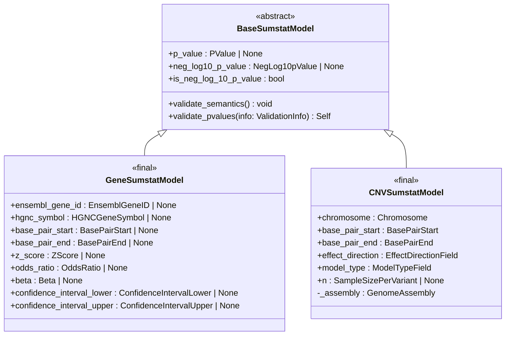

# Summary statistics class design

Date: 2026-01-27

## Status

Proposed

## Context

We need to build components for validating summary statistics in a reusable and
modular way.

Many fields are shared across different types of summary statistics, for example
SNP, CNV, and gene-based summary statistics all record p-values. The type
definitions and model validators should be defined only once. Pydantic supports
this by default through inheritance.

## Decision

The `BaseSumstatModel` enforces a common public API for semantic validation with
an `@abstractmethod`.

Consumers of this data model should always call `validate_semantics()` after
Pydantic does structural validation. However, semantic validation may
deliberately do nothing when certain checks are considered out of scope for the
data model and are better handled by dedicated ETL pipelines (e.g. dbSNP
remapping).

Private attributes are set at runtime using
[validation context](https://docs.pydantic.dev/latest/concepts/validators/#validation-context)
to avoid polluting the data model.

If you want to implement a new data model you should:

1. Create a new Python package inside `src/gwascatalog/sumstatlib`
2. Set up annotated types for each field in the new model, importing and reusing
   types from the `core` package where possible
3. Compose a new data model from the annotated types, inheriting from the
   abstract `BaseSumstatModel` class
4. Add tests for your new types and model
5. Add your model to `__all__` in the library's root `__init__.py`

All concrete `Sumstat` models must be annotated with `@final` to discourage
excessive hierarchies.

## Consequences

The final Pydantic models will do structural validation implemented with
type-driven design.

Semantic validation is offered via a consistent public API (
`validate_semantics`). Some semantic validation which requires large reference
data or compute will often be out of scope (e.g. remapping SNPs against dbSNP),
and are better suited to dedicated ETL pipelines.

Extending these data models with extra layers of inheritance is discouraged with
the `@final` annotation. If more complex data models are needed (e.g. including
metadata models) composition is a better approach.

Instantiating millions of Python classes is a bottleneck for any validation
process compared with vectorised alternatives (e.g. Pandera). However,
reusability and correctness were given more weight during the design process. As
a result, consumers should consider distributing work across multiple processes.
