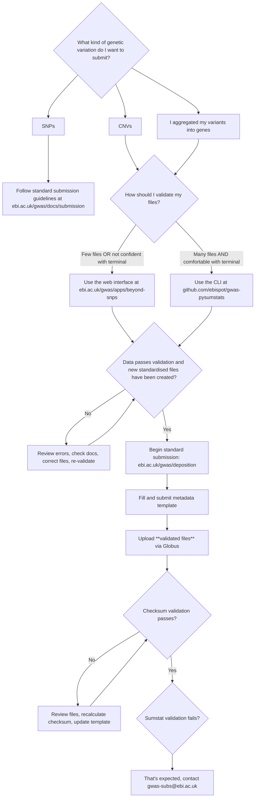

# How to submit gene-based and CNV GWAS to the GWAS Catalog

:::tip It's OK to fail

* Our CNV and gene-based data models are draft standards
* They have not yet been fully integrated into our submission system
* We request that submitters validate their data locally prior to submission
* This means that your submission is **expected to fail validation after you submit it**
* [Get in touch with us](mailto:gwas-subs@ebi.ac.uk) and we will manually process your submission
* See below for the expected process
:::

