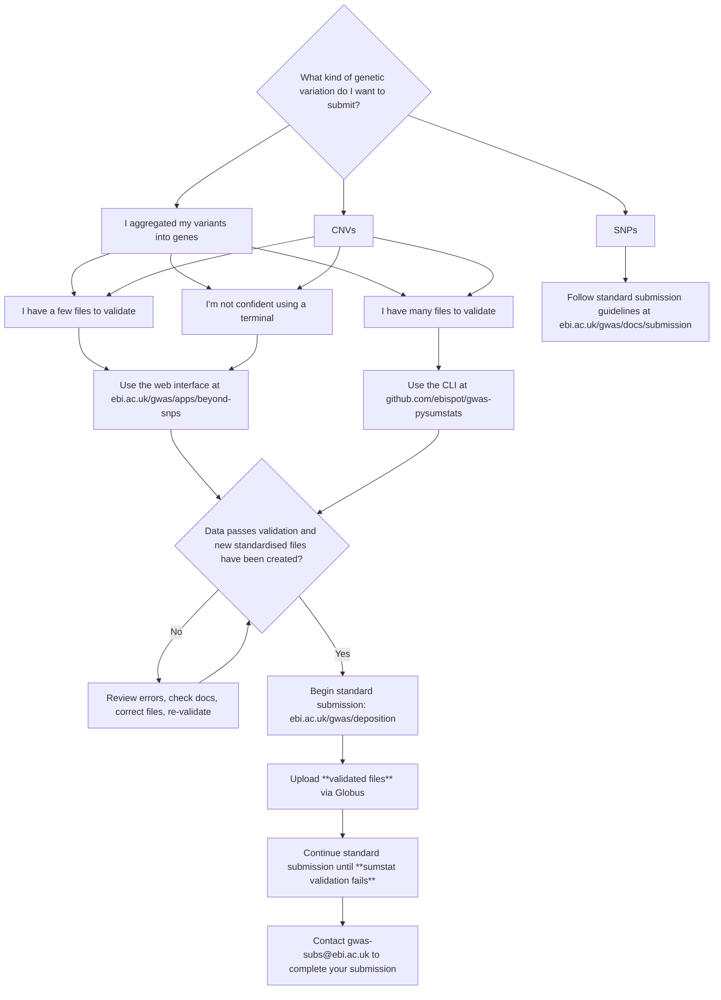

# How to submit gene-based and CNV GWAS to the GWAS Catalog

```mermaid
flowchart TD

    A{What kind of genetic variation do I want to submit?}
    B[SNPs]
    C[CNVs]
    D[I aggregated my variants into genes]

    A --> B
    A --> C
    A --> D

    E[I have many files to validate]
    F[I have a few files to validate]
    G[I'm not confident using a terminal]

    H[Use the web interface at ebi.ac.uk/gwas/apps/beyond-snps]
    I[Use the CLI at github.com/ebispot/gwas-pysumstats]

    E --> I
    F --> H
    G --> H

    D --> E & F & G
    C --> E & F & G

    J{Data passes validation and new standardised files have been created?}

    H & I --> J

    K[Review errors, check docs, correct files, re-validate]

    J -->|No| K
    K --> J

    L[Begin standard submission: ebi.ac.uk/gwas/deposition]
    J -->|Yes| L

    M[Upload **validated files** via Globus]
    L --> M

    N[Continue standard submission until **sumstat validation fails**]
    M --> N

    O[Contact gwas-subs@ebi.ac.uk to complete your submission]
    N --> O

    Z[Follow standard submission guidelines at ebi.ac.uk/gwas/docs/submission]
    B --> Z
```