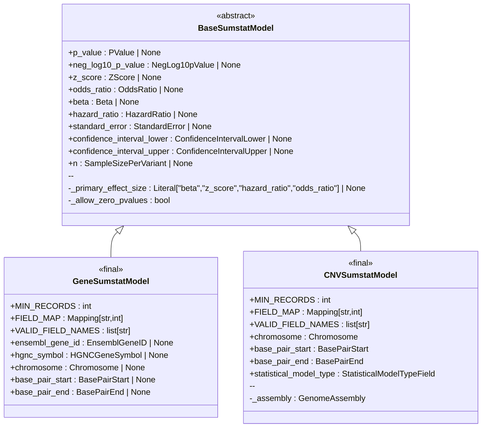

## Developer notes

### Data model overview

This library contains Pydantic models which support validating Gene-based GWAS and Copy Number Variant (CNV) GWAS. In the future new types of data might be validated (e.g. SNPs).

### Implementing a new data model

If you want to implement a new data model you should:

1. Create a new Python package inside `src/gwascatalog/sumstatlib`
2. Set up annotated types for each field in the new model, importing and reusing types from the `core` package where possible
3. Compose a new data model from the annotated types, inheriting from the abstract `BaseSumstatModel` class
4. Add tests for your new types and model
5. Add your model to `__all__` in the library's root `__init__.py` 

